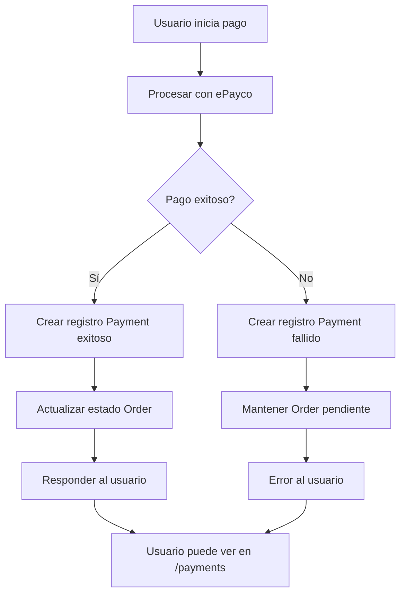

# 💳 Sistema de Pagos - Implementación Completa

## 🎯 Funcionalidades Implementadas

### ✅ Registro Automático de Pagos

- **Registro en Base de Datos**: Todos los pagos se guardan automáticamente en la tabla `payments`
- **Información Completa**: Incluye datos de ePayco, información del cliente y métrica del pago
- **Manejo de Fallos**: Se registran tanto pagos exitosos como fallidos para auditoría

### ✅ API Endpoint para Consulta de Pagos

- **Endpoint**: `GET /api/orders/payments`
- **Autenticado**: Solo usuarios autenticados pueden ver sus propios pagos
- **Paginado**: Soporte para paginación con `skip` y `limit`
- **Información Completa**: Incluye datos del pago y de la orden asociada

## 🗄️ Modelo de Base de Datos

### Tabla `payments` - Campos Expandidos

```sql
CREATE TABLE payments (
    id UUID PRIMARY KEY,
    order_id UUID NOT NULL REFERENCES orders(id),

    -- Payment amount and status
    amount NUMERIC(10, 2) NOT NULL,
    status VARCHAR(50) NOT NULL,  -- completed, pending, failed, etc.

    -- ePayco payment information
    epayco_transaction_id VARCHAR(100),  -- ID de la transacción en ePayco
    epayco_response_code INTEGER,        -- Código de respuesta de ePayco (1-11)
    epayco_response_message TEXT,        -- Mensaje de respuesta de ePayco
    epayco_approval_code VARCHAR(50),    -- Código de aprobación del banco
    epayco_receipt VARCHAR(100),         -- Número de recibo de ePayco

    -- Payment method information
    payment_method VARCHAR(50) DEFAULT 'credit_card',
    card_last_four VARCHAR(4),           -- Últimos 4 dígitos (seguro)
    card_brand VARCHAR(20),              -- Visa, Mastercard, etc.

    -- Client information
    client_name VARCHAR(200),
    client_email VARCHAR(200),
    client_phone VARCHAR(20),
    client_ip INET,

    -- Timestamps
    created_at TIMESTAMP DEFAULT NOW(),
    processed_at TIMESTAMP,             -- Cuando se procesó el pago
    updated_at TIMESTAMP DEFAULT NOW()
);
```

## 🚀 Endpoints de la API

### 1. Procesamiento de Pago

```http
POST /api/orders/{order_id}/pay
```

**Funcionalidad Nueva**:

- ✅ **Registro Automático**: Crea un registro en `payments` para cada intento de pago
- ✅ **Información de Tarjeta**: Guarda últimos 4 dígitos y marca de tarjeta de forma segura
- ✅ **Datos de ePayco**: Almacena toda la respuesta de ePayco para auditoría
- ✅ **Información del Cliente**: Guarda datos del cliente y IP para seguridad

### 2. Consulta de Pagos de Usuario

```http
GET /api/orders/payments?skip=0&limit=100
```

**Response**:

```json
{
  "payments": [
    {
      "id": "uuid",
      "order_id": "uuid",
      "amount": 25.99,
      "status": "completed",
      "payment_method": "credit_card",

      "epayco_transaction_id": "12345",
      "epayco_response_code": 1,
      "epayco_response_message": "Transacción aprobada",
      "epayco_approval_code": "123456",
      "epayco_receipt": "789012",

      "card_last_four": "1234",
      "card_brand": "Visa",

      "client_name": "Juan Pérez",
      "client_email": "juan@example.com",
      "client_phone": "3001234567",
      "client_ip": "192.168.1.1",

      "created_at": "2024-01-15T10:30:00",
      "processed_at": "2024-01-15T10:30:05",
      "updated_at": "2024-01-15T10:30:05",

      // Información de la orden asociada
      "order_total": 25.99,
      "order_status": "completed",
      "order_created_at": "2024-01-15T10:25:00"
    }
  ],
  "total": 15
}
```

## 🔐 Seguridad Implementada

### ✅ Protección de Datos Sensibles

- **Tarjetas**: Solo se guardan los últimos 4 dígitos, nunca el número completo
- **PCI Compliance**: Cumple con estándares de seguridad para datos de tarjetas
- **IP Tracking**: Registra IP del cliente para auditoría de seguridad

### ✅ Autorización

- **Usuarios Autenticados**: Solo usuarios logueados pueden ver sus pagos
- **Aislamiento de Datos**: Cada usuario solo ve sus propios pagos
- **Validación de Sesión**: Usa el sistema de sesiones implementado

## 📊 Estados de Pago Soportados

| Código ePayco | Estado en DB | Descripción     |
| ------------- | ------------ | --------------- |
| 1             | `completed`  | Pago exitoso    |
| 2             | `rejected`   | Pago rechazado  |
| 3             | `pending`    | Pago pendiente  |
| 4             | `failed`     | Pago fallido    |
| 6             | `reversed`   | Pago reversado  |
| 7             | `retained`   | Pago retenido   |
| 8             | `started`    | Pago iniciado   |
| 9             | `expired`    | Pago expirado   |
| 10            | `abandoned`  | Pago abandonado |
| 11            | `canceled`   | Pago cancelado  |

## 🛠️ Archivos Modificados/Creados

### ✅ Modelos

- `app/models/payment.py` - Expandido con nuevos campos
- `app/models/order.py` - Ya tenía relación con Payment

### ✅ Esquemas

- `app/schemas/payment.py` - Nuevos esquemas para API

### ✅ CRUD

- `app/crud/payments.py` - Operaciones de base de datos para pagos

### ✅ API Routes

- `app/api/routes/orders.py` - Endpoint de pagos y registro automático

## 🔄 Flujo de Pago Completo



## 🧪 Casos de Prueba

### Escenario 1: Pago Exitoso

1. Usuario hace pago con tarjeta válida
2. ePayco responde código 1 (exitoso)
3. Se crea registro en `payments` con estado `completed`
4. Orden se marca como `completed`
5. Usuario puede ver el pago en `/api/orders/payments`

### Escenario 2: Pago Fallido

1. Usuario hace pago con tarjeta inválida
2. ePayco responde código 4 (fallido)
3. Se crea registro en `payments` con estado `failed`
4. Orden mantiene estado anterior
5. Usuario puede ver el intento fallido en `/api/orders/payments`

### Escenario 3: Consulta de Historial

1. Usuario accede a `/api/orders/payments`
2. Ve todos sus pagos ordenados por fecha (más recientes primero)
3. Puede paginar con `skip` y `limit`
4. Ve información completa de cada pago

## 📋 Próximos Pasos

### Migración de Base de Datos

```bash
# Crear migración
alembic revision --autogenerate -m "expand_payments_table_with_epayco_and_client_info"

# Aplicar migración
alembic upgrade head
```

### Frontend (Opcional)

- Crear componente para mostrar historial de pagos
- Agregar sección de pagos en el perfil del usuario
- Mostrar estado detallado de cada pago

## ✨ Beneficios Implementados

### Para el Negocio

- 📊 **Auditoría Completa**: Todos los pagos quedan registrados
- 🔍 **Rastreabilidad**: Se puede seguir cada transacción
- 📈 **Analytics**: Datos para analizar patrones de pago
- 🛡️ **Seguridad**: Tracking de IPs y detección de fraudes

### Para el Usuario

- 📱 **Transparencia**: Pueden ver su historial completo de pagos
- 🔍 **Detalles**: Información completa de cada transacción
- 📋 **Organización**: Pagos ordenados y paginados
- 🔐 **Privacidad**: Solo ven sus propios datos

## 🎉 Resultado Final

El sistema de pagos ahora es **completo y auditable**:

- ✅ **Registro Automático** de todos los intentos de pago
- ✅ **API Completa** para consultar historial de pagos
- ✅ **Seguridad Implementada** con protección de datos sensibles
- ✅ **Integración con ePayco** manteniendo toda la información relevante
- ✅ **Base de Datos Expandida** con campos necesarios para auditoría

¡El sistema está listo para producción! 🚀
