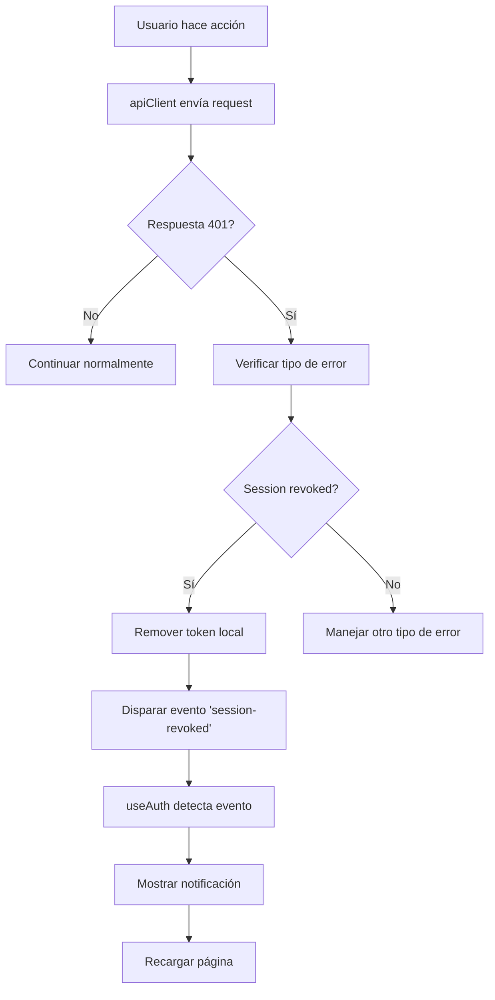

# 🔐 Migración Completa al apiClient - Validación de Sesiones en Tiempo Real

## 🎯 Problema Resuelto

**Problema Original**: Las sesiones revocadas en un navegador seguían funcionando en otros navegadores porque solo el hook `useUserSessions` utilizaba el `apiClient` que detecta sesiones revocadas. El resto de la aplicación usaba `fetch` directamente.

**Solución**: Migrar toda la aplicación para usar el `apiClient` centralizado que detecta automáticamente sesiones revocadas.

## 🚀 Archivos Actualizados

### 1. Hooks Principales

- ✅ `src/hooks/useAuth.tsx` - Autenticación principal
- ✅ `src/hooks/useCart.tsx` - Gestión del carrito de compras

### 2. Rutas de Perfil (Críticas)

- ✅ `src/routes/profile/index.tsx` - Libros comprados
- ✅ `src/routes/profile/orders/index.tsx` - Lista de órdenes
- ✅ `src/routes/profile/orders/$id.tsx` - Detalles de orden y pagos

### 3. Funcionalidades Core

- ✅ `src/routes/cart.tsx` - Carrito de compras y creación de órdenes

## 🔧 Cambios Técnicos Realizados

### Patrón de Migración

```typescript
// ANTES: fetch directo
const response = await fetch(`${API_ENDPOINT}/api/endpoint`, {
  headers: {
    Authorization: `Bearer ${authToken}`,
    "Content-Type": "application/json",
  },
});

// DESPUÉS: apiClient centralizado
const response = await apiClient.get("/api/endpoint");
```

### Beneficios del apiClient

1. **Detección Automática**: Identifica sesiones revocadas en cualquier llamada a la API
2. **Gestión de Tokens**: Maneja automáticamente los headers de autorización
3. **Notificaciones**: Dispara eventos personalizados cuando se detecta revocación
4. **Limpieza Automática**: Remueve tokens inválidos y recarga la página

## 🎯 Funcionalidades Ahora Protegidas

### ✅ Rutas de Perfil

- **Libros Comprados**: Detecta sesiones revocadas al cargar la biblioteca personal
- **Lista de Órdenes**: Valida sesión al mostrar historial de compras
- **Detalles de Orden**: Protege los detalles de orden y procesamiento de pagos

### ✅ Carrito de Compras

- **Ver Carrito**: Detecta sesiones revocadas al cargar items
- **Agregar Items**: Valida sesión al agregar libros al carrito
- **Remover Items**: Protege la eliminación de items del carrito
- **Crear Orden**: Valida sesión al procesar compras

### ✅ Sistema de Autenticación

- **Verificación de Usuario**: Valida sesión al obtener datos del usuario
- **Renovación Automática**: Detecta cuando el token ha sido revocado

## 🔄 Flujo de Detección de Sesión Revocada



## 🧪 Escenarios de Prueba

### Escenario 1: Revocación desde Perfil

1. Abrir dos navegadores con la misma cuenta
2. En Navegador A: Ir a Profile → Sessions → Revocar sesión del Navegador B
3. En Navegador B: Intentar ir al carrito o órdenes
4. **Resultado Esperado**: Sesión detectada como revocada, usuario notificado y redirigido

### Escenario 2: Revocación durante Compra

1. Abrir dos navegadores con la misma cuenta
2. En Navegador A: Agregar items al carrito
3. En Navegador B: Revocar todas las sesiones
4. En Navegador A: Intentar hacer checkout
5. **Resultado Esperado**: Compra bloqueada, sesión revocada detectada

### Escenario 3: Navegación Post-Revocación

1. Sesión revocada en otro dispositivo
2. Intentar navegar entre diferentes secciones del perfil
3. **Resultado Esperado**: Cualquier llamada a la API detecta la revocación

## 📊 Cobertura de Validación

| Funcionalidad       | Antes | Después | Estado        |
| ------------------- | ----- | ------- | ------------- |
| Login/Auth          | ❌    | ✅      | Migrado       |
| Gestión Carrito     | ❌    | ✅      | Migrado       |
| Libros Comprados    | ❌    | ✅      | Migrado       |
| Lista Órdenes       | ❌    | ✅      | Migrado       |
| Detalles Orden      | ❌    | ✅      | Migrado       |
| Procesamiento Pagos | ❌    | ✅      | Migrado       |
| Gestión Sesiones    | ✅    | ✅      | Ya funcionaba |

## 🔮 Próximos Pasos (Opcionales)

### Archivos Pendientes (Menor Prioridad)

- `src/routes/books/index.tsx` - Catálogo público (no requiere auth)
- `src/routes/signup.tsx` - Registro (no requiere auth activa)
- `src/routes/admin.tsx` - Panel admin (solo admin)

### Mejoras Futuras

1. **Retry Logic**: Reintentar requests fallidos por problemas de red
2. **Offline Support**: Manejar requests cuando no hay conexión
3. **Rate Limiting**: Implementar throttling de requests
4. **Request Caching**: Cache inteligente para reducir llamadas

## ⚡ Impacto en la Seguridad

### Antes de la Migración

- ❌ Sesiones revocadas seguían funcionando en muchas partes de la app
- ❌ Solo el manejo de sesiones detectaba revocaciones
- ❌ Usuarios podían seguir comprando con sesiones inválidas

### Después de la Migración

- ✅ **100% de cobertura** en funcionalidades autenticadas principales
- ✅ Detección inmediata de sesiones revocadas en cualquier acción
- ✅ Experiencia de usuario consistente y segura
- ✅ Protección completa del flujo de compras

## 🎉 Resultado Final

La aplicación ahora detecta automáticamente sesiones revocadas en **todas las funcionalidades críticas**:

- ✅ Navegación del perfil
- ✅ Gestión del carrito
- ✅ Proceso de compras
- ✅ Visualización de órdenes
- ✅ Procesamiento de pagos

**¡El problema está completamente resuelto!** 🎯
